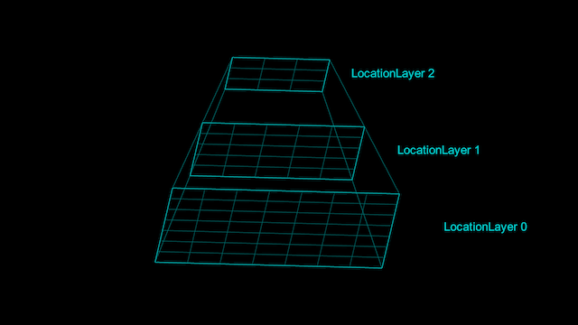

# Internal Layer Levels

Normally layers are separate, and chunk sizes are an implementation detail of each layer.

LayerProcGen also supports an alternative pattern: Internal levels within a layer.

Each layer level is like its own layer, except:

- The chunks are shared across the levels and are thus also all of the same size. A `level` property of each chunk keeps track of which level it has currently been generated up to.
- The layer and chunk class is shared for all the levels, and there is no explicit data request interface between levels.
- Each level is assumed to depend on the immediate neighbor chunks in the previous level.



## Basic setup

To make use of internal layer levels, override the `GetLevelCount` method of your layer and make it return a constant which is the amount of levels of the layer.

```cs
public override int GetLevelCount() { return 3; }
```

Optionally you can use an enum to associate names with each layer, which may make it easier to remember what each layer does. Using an additional `Length` enum entry at the end makes it simple to get the amount of levels based on the enum.

```cs
public enum Levels { Generation, Processing, Instantiation, Length }
public override int GetLevelCount() { return (int)Levels.Length; }
```

The Create method of the chunk takes a level parameter which specifies which level is being created or destroyed. You can structure your code like this:

```cs
public class ExampleChunk : LayerChunk<ExampleLayer, ExampleChunk> {
	// Data for Generation level of this chunk goes here.
	
	// Data for Processing level of this chunk goes here.
	
	// Data for Instantiation level of this chunk goes here.

	public override void Create(int level, bool destroy) {
		if (level == (int)ExampleLayer.Levels.Generation) {
			if (destroy) {
				// Destroy data for level 0 of this chunk here.
			}
			else {
				// Create data for level 0 of this chunk here.
			}
		}
		if (level == (int)ExampleLayer.Levels.Processing) {
			if (destroy) {
				// Destroy data for level 1 of this chunk here.
			}
			else {
				// Create data for level 1 of this chunk here.
			}
		}
		if (level == (int)ExampleLayer.Levels.Instantiation) {
			if (destroy) {
				// Destroy data for level 2 of this chunk here.
			}
			else {
				// Create data for level 2 of this chunk here.
			}
		}
	}
}
```

See the [Script Templates](ScriptTemplates.md) page for a full template of a chunk and layer class with internal layer levels.

## Data access

When using internal layer levels, it's up to you to only access the right data.

- When a chunk generates data for a given level, it may read and write its own data for that level.
- Additionally it may read, *but not modify*, data for lower levels stored in itself as well as the immediate neighbor chunks.

The layer can implement a method such as this to let chunks access their neighbors:

```cs
// Method for chunks to get neighbor chunks. Includes chunk itself.
public IEnumerable<ExampleChunk> GetNeighborChunks(ExampleChunk chunk) {
	for (int i = -1; i <= 1; i++) {
		for (int j = -1; j <= 1; j++) {
			yield return chunks[chunk.index.x + i, chunk.index.y + j];
		}
	}
}
```

## External dependencies

Assuming two layers ALayer and BLayer, if ALayer is using internal layer levels, BLayer can specify a dependency on a specific level of ALayer by supplying a parameter after the padding which indicates the required "provider" level.

```cs
// Code in BLayer constructor.
int otherProviderLevel = (int)ALayer.Levels.Processing);
AddLayerDependency(new LayerDependency(ALayer.instance, new Point(16, 16), otherProviderLevel);
```

The default is the highest level, when no level parameter is specified.

Likewise, ALayer can specify that a specific level of its own has a dependency on BLayer by supplying a parameter prior to the LayerDependency which specify its own "user" level of the dependency.

```cs
// Code in ALayer constructor.
int ownUserLevel = (int)Levels.Instantiation;
AddLayerDependency(ownUserLevel, new LayerDependency(BLayer.instance, new Point(16, 16)));
```

The default is the lowest level if no level parameter is specified.

## Pros and cons

Using internal layer levels can be beneficial in certain cases, but can also have disadcantages.

**Pros**

- If you have generation logic which does not treat chunk size as an implementation detail, but depends on multiple layers having the same chunk size, internal layer levels may reflect this better than using separate layers.
- For certain use cases it may be easier to simply know that you have adjacent chunks available from the lower level than to reason about and calculate how much padding is needed for a data request.
- There can be slightly less overhead in how data is accessed.

**Cons**

- Different levels of a layer are tightly coupled which may be less flexible.
- Since all layer levels share the same chunks, and thus have access to the same stored chunk data, the framework offers less guidance towards only accessing the allowed data for each layer level. This requires dilligence of the implementer to keep track of which data is associated with which layer levels.
